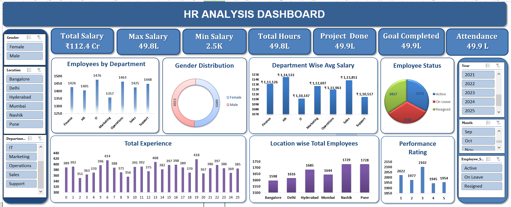

# 📊 HR Analytics Dashboard

## 📌 Project Overview

The **HR Analytics Dashboard** is an interactive Microsoft Excel project developed to analyze and visualize employee-related data.

The objective of this project is to transform raw HR data into meaningful insights that can help organizations understand employee performance, salary distribution, attendance, experience, departmental trends, and workforce characteristics.

---

## 🎯 Project Objectives

- Analyze employee salary and compensation patterns
- Understand employee distribution across departments and locations
- Analyze attendance and working hours
- Evaluate employee performance and goal completion
- Identify workforce trends based on experience
- Analyze employee status and demographic information
- Present important HR KPIs through an interactive dashboard

---

## 🛠️ Tools & Technologies

- **Microsoft Excel**
- Pivot Tables
- Pivot Charts
- Slicers
- Excel Formulas
- Data Cleaning
- Data Transformation
- Data Analysis
- Data Visualization
- Dashboard Design

---

## 📂 Project Structure

The Excel workbook contains multiple sheets representing different stages of the analysis:

### 1. HR_Data
Contains the original HR dataset used for the analysis.

### 2. Raw Work
Contains data preparation, cleaning, calculations, and analysis performed on the raw dataset.

### 3. Dashboard
Contains the interactive HR analytics dashboard with important KPIs and visualizations.

### 4. Dashboard (2)
Contains an additional/final version of the dashboard.

---

## 📈 Key KPIs & Analysis

The dashboard provides insights into:

- 💰 Total Salary
- 💼 Average Salary
- ⏱️ Total Working Hours
- 📊 Project Completion
- 🎯 Goal Completion
- 📅 Attendance
- 👥 Employee Count
- 🏢 Department-wise Employee Distribution
- 💵 Department-wise Average Salary
- 📍 Location-wise Employee Distribution
- ⭐ Performance Rating
- 👨‍💼 Employee Experience
- 👤 Employee Status
- ⚧️ Gender Distribution

---

## 🔍 Key Business Questions

This project helps answer questions such as:

- Which departments have the highest number of employees?
- Which departments offer the highest average salary?
- How is employee performance distributed?
- What is the relationship between experience and performance?
- Which locations have the highest employee count?
- How does attendance vary across employees?
- What is the overall salary distribution?
- How many employees have completed their assigned projects and goals?

---

## 📊 Dashboard Preview

---

## 💡 Project Insights

The dashboard converts raw HR data into an easy-to-understand visual report, allowing users to quickly identify trends, compare departments, and monitor important employee-related KPIs.

This project demonstrates practical skills in **data cleaning, data analysis, KPI development, data visualization, and dashboard creation using Microsoft Excel.**

---

## 🚀 Skills Demonstrated

Through this project, I strengthened my skills in:

- Data Cleaning
- Data Analysis
- Excel
- Pivot Tables
- Data Visualization
- KPI Analysis
- Dashboard Development
- Business Insight Generation

---

## 👨‍💻 Author

**Suyash Tambe**

Aspiring Data Analyst | Excel | SQL | Python | Power BI

---

⭐ If you find this project useful, feel free to explore the repository and share your feedback.
